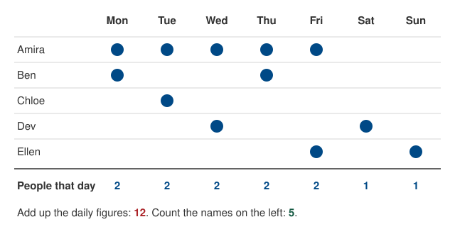
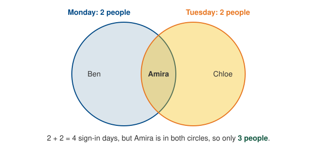
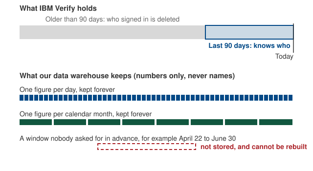

A unique-user figure counts people, not sign-ins. That makes it behave
differently from most numbers in this cookbook. This page explains the two rules
that follow, why they exist, and what to ask for instead.

The short version:

1. Unique-user figures for two periods cannot be added together.
2. A unique-user figure only exists for the windows we set up in advance: each
   day and each calendar month. Any other window cannot be counted after the
   fact.

## One week, two ways of counting

Here is a week of sign-ins by five people. A dot means that person signed in
that day.

{fig-alt="Five people across a week. The daily counts of people add up to 12, but only five people appear in the grid."}

Both totals are correct. They answer different questions.

- **12** is the number of *person-days*: the number of times someone showed up
  on a given day. Amira counts five times because she came on five days.
- **5** is the number of *people*. Amira counts once no matter how many days
  she came.

The daily unique-user figure is the "people that day" row. Adding that row up
gives person-days, not people. So a report that says "we had 12 unique users
this week" would be wrong. The true figure is 5.

## Why the totals do not add

Adding two unique-user figures only works if nobody appears in both. In
practice, the regular users appear in every period, and they get counted again
each time.

{fig-alt="Two overlapping circles labelled Monday and Tuesday. Amira is in both, so two plus two gives three people, not four."}

To get the true figure you need to know who was in the overlap. That means
knowing *which* people were behind each count, and we do not have that
information.

The same thing happens across applications. Someone who uses two integrated
applications is one unique user for CanadaLogin overall but appears in each
application's own count. Adding up the applications' figures over-counts them,
and the overall CanadaLogin figure will always be smaller than that sum.

## What we keep, and what we do not

IBM Verify, the service behind CanadaLogin sign-in, is the only system that
knows who signed in. It keeps that per-person record for 90 days, then deletes
it.

Our data warehouse never receives the per-person record at all. That is a
deliberate choice, required by the security and privacy rules CanadaLogin
operates under. Each day, IBM Verify counts up the day's activity
and hands us the finished numbers: how many people signed in that day, and how
many distinct people have signed in so far this month. We store the numbers.
We do not store, and cannot look up, who was behind them.

{fig-alt="IBM Verify keeps who signed in for 90 days. The warehouse keeps one figure per day and one per calendar month, both forever. A custom window such as April 22 to June 30 is not stored and cannot be rebuilt."}

This is why a unique-user count exists only for the windows we asked for in
advance. If nobody asked for "April 22 to June 30" before those days happened,
the count was never made. We cannot make it now, because we hold no names to
count, and after 90 days neither does IBM Verify.

## What you can and cannot ask for

| Question | Can we answer it? |
|---|---|
| How many people signed in yesterday? | Yes. We have a figure for every day. |
| How many people signed in in July? | Yes. We have a figure for every calendar month. |
| How many people signed in on average per day in July? | Yes. Averaging the daily figures is fine; it is adding them that misleads. |
| How many people signed in from April 22 to June 30? | No. That window was not set up in advance, and it cannot be rebuilt. |
| How many people signed in in the second quarter? | No. A quarter is three monthly figures, and monthly figures cannot be added. |
| How many people used Application A or Application B? | No. Each application has its own figure, and the two overlap. |
| How many people have signed in this year? | Not reliably. See the next section. |

Person-days, the "12" above, is a legitimate measure on its own. It is the right
denominator for a rate such as calls per active user, where each day's activity
should count. Just do not present it as a number of people.

## Year-to-date and 365-day figures

The tables also carry a year-to-date figure and a rolling 365-day figure. Both
are calculated by IBM Verify over a window longer than the 90 days of
per-person data it holds, so they cannot be right. The year-to-date figure has
been seen going down from one day to the next, which a true cumulative count
cannot do. Do not quote either figure until the pipeline is fixed. The daily and
monthly figures are unaffected because both windows fit inside 90 days.

## If you need a window we do not have

The Data and Research team cannot pull an ad hoc unique-user count for a custom
date range. What they can do, given a legitimate business need, is add a new
standing window to the pipeline so it is counted from then on. Before asking,
know that:

- adding a window takes weeks, not days or hours;
- the new figure starts on the day it goes live, and nothing before that can
  be filled in;
- the window must be 90 days or shorter, for the reasons above.

For the analyst-facing details, see the
[Cumulative Unique Users](ibm_verify.qmd#cumulative-unique-users) metric and the
[`auth_total_logins`](../catalog/ibm_verify.qmd#auth_total_logins) catalog
entry.
